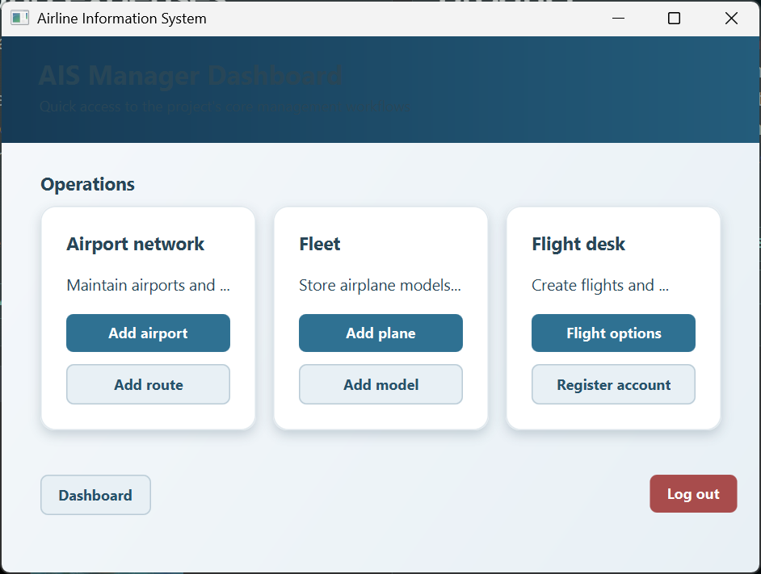

# PRJ2 - Airline Information System

The Airline Information System is a desktop application that brings the day-to-day parts of an airline together in one place. We implemented role-based access for managers, officers, and employees, along with workflows for managing airports, routes, aircraft, flights, customers, bookings, and tickets. The application is supported by a relational database and a GUI for working with the data.

## Setup and demo access

Local database setup details and demo accounts are available in [Setup Information](Setup%20Information.md).

## Table Of Contents

- [1 Analysis](/analysis)
  - [1.1 Activity Diagram](/analysis/Activity%20Diagram)
  - [1.1.1 Activity Diagram Image](/analysis/Activity%20Diagram/Activity%20diagram.svg)
  - [1.2 Domain Model](/analysis/Domain%20Model)
  - [1.2.1 Domain Model Image](/analysis/Domain%20Model/Domain%20model.svg)
  - [1.3 Entity Relationship Model](/analysis/Entity%20Relationship%20Model)
  - [1.3.1 Entity Relationship Model Image](/analysis/Entity%20Relationship%20Model/ER-Model.svg)
  - [1.4 Sequence Diagrams](/analysis/Sequence%20Diagrams)
  - [1.4.1 Sequence Diagram Create Plane](/analysis/Sequence%20Diagrams/Create%20Plane.vpp)
  - [1.4.1.1 Sequence Diagram Create Plane Image](/analysis/Sequence%20Diagrams/Create%20Plane.svg)
  - [1.5 Use Case Diagram](/analysis/Use%20Case%20Diagram)
  - [1.5.1 Use Case Diagram Image](/analysis/Use%20Case%20Diagram/Use%20Case%20Diagram.svg)
  - [1.6 Data Dictionary](/analysis/Data%20Dictionary.md)
  - [1.7 Test Scenarios](/analysis/Test%20Scenario.md)
  - [1.8 Use Cases](/analysis/Use%20case.md)
  - [1.9 Use Case Description](/analysis/Use%20Case%20Description.md)
  - [1.10 User Stories](/analysis/User%20Stories.md)
- [2 Design](/design)
  - [2.1 Class Diagram](/design/Class%20Diagram)
  - [2.2 Class Diagram Image](/design/Class%20Diagram/Class%20Diagram.png)
  - [2.3 Database Schema](/design/Database%20Schema)
  - [2.4 Database Schema Image](/design/Database%20Schema/Database-Schema-ais.svg)
  - [2.5 Sequence Diagrams](/design/Sequence%20Diagrams)
  - [2.6 Sequence Diagram Create Plane](/design/Sequence%20Diagrams/Create%20Plane.vpp)
  - [2.7 Sequence Diagram Create Plane Image](/design/Sequence%20Diagrams/Create%20Plane.svg)
  - [2.8 Sequence Diagram Plane Model](/design/Sequence%20Diagrams/Plane%20Model.vpp)
- [3 Implementation](/implementation/)
  - [3.1 Assembler](/implementation/Assembler)
  - [3.2 GUI Layer](/implementation/GUIlayer)
  - [3.3 Data Records](/implementation/DataRecords)
  - [3.4 Persistence](/implementation/Persistence)
  - [3.5 Business Logic Layer](/implementation/businessLogicLayer)
  - [3.6 Pom File](/implementation/airlineinformationsystem/pom.xml)
- [4 Table Of Contents](/README.md)
